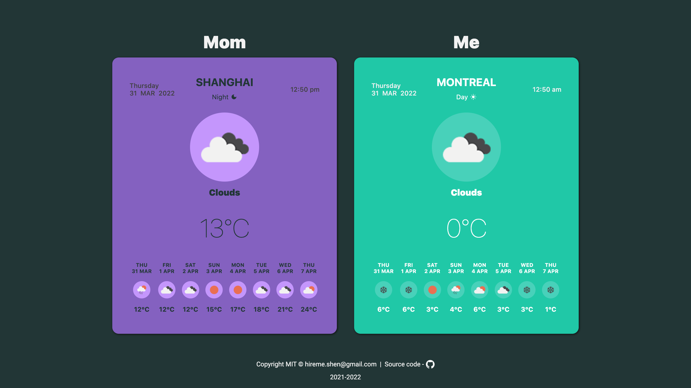

# mom
         

Online Javascript weather app for my mom. Online preview: [ciaoshen.com/mom](http://ciaoshen.com/mom)

## OpenWeather API
Weather forcast data comes from [OpenWeather API](https://openweathermap.org/api). 

## Async JS
Using ES2017 `async` and `await`.

## MVC
This project is developed with MVC pattern. 

1. `model.js`: A DAO(Data Access Object) API. It's aware of the data structure.
2. `view.js`: All DOM manipulations go to this file. 
3. `controller.js`: A general manager. He is the only one who knows all the logic of different features. But he is blind from both data and DOM. `model.js` and `view.js` do these concrete tasks for him.

## Conclusion
Happy coding! I love you mom❤️